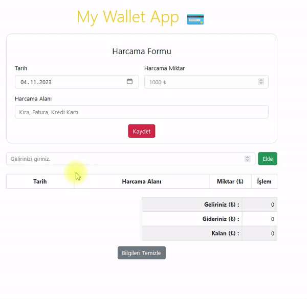

<p>Clarusway</p>

# Project-03 : Wallet App (JS-03)

## Description

This assignment will help students practice their JavaScript skills by building a simple expense tracker application. This application allows users to keep track of their income and expenses and displays a summary of their financial status. Students will work with JavaScript, HTML, and local storage to create this functional tool.

## Problem Statement

- Your company has recently started on a project that aims to create a simple Wallet App. So you and your colleagues have started to work on the project.
- User should create, delete  and mark tasks as them done or undone

## Project Skeleton 

```plaintext
03-Wallet App (folder)
|
|----readme.md         # Given to the students (Definition of the project)          
|----solution
        |----index.html  
        |----App.js
```

## Expected Outcome




## Demo

https://wallet-app-rust.vercel.app/

## Objective
 - When the income form is submitted, the  event listener prevents the page from reloading, adds the income to the total, stores it in local storage, resets the input field, and updates the result table.
 - When the page loads, the load event listener retrieves the income and expense data from local storage, populates the expense table, sets the current date in the date input field, and updates the result table.
 - When the expense form is submitted, the event listener prevents the page from reloading, creates an expense object, adds it to the expense array, stores the array in local storage, populates the expense table, and updates the result table.
 - Function takes an expense object, creates a new row in the expense table, and displays the date, description, and amount of the expense.


### At the end of the project, following topics are to be covered;

- HTML 

- Bootstrap

- JS


### At the end of the project, students will be able to;

- improve coding skills within HTML & Bootstrap & JS

- use git commands (push, pull, commit, add etc.) and Github as Version Control System.

## Steps to Solution
  
- Step 1: Download or clone project repo on Github 

- Step 2: Create project folder for local public repo on your pc

- Step 3: Create JS code for To-Do App 

>>Part-1 HTML Structure

	- Creat structure of the HTML5
	- Give name of your project (title)
	- Create the main structure of the HTML
  - Use Bootstrap for styling.

>>Part-2 JS Structure

	- Create code for Wallet App : Track of your income and expenses and provides a summary of your financial status. Use local storage to store your income and expense data, so you can continue tracking your finances even after closing or refreshing the page.
	
- Step 3: Push your application into your own public repo on Github

- Step 4: Deploy your application on Github template to showcase your app within your team.


<p align='center'> <strong>⌛ Happy Coding  ✍</strong> </p>


